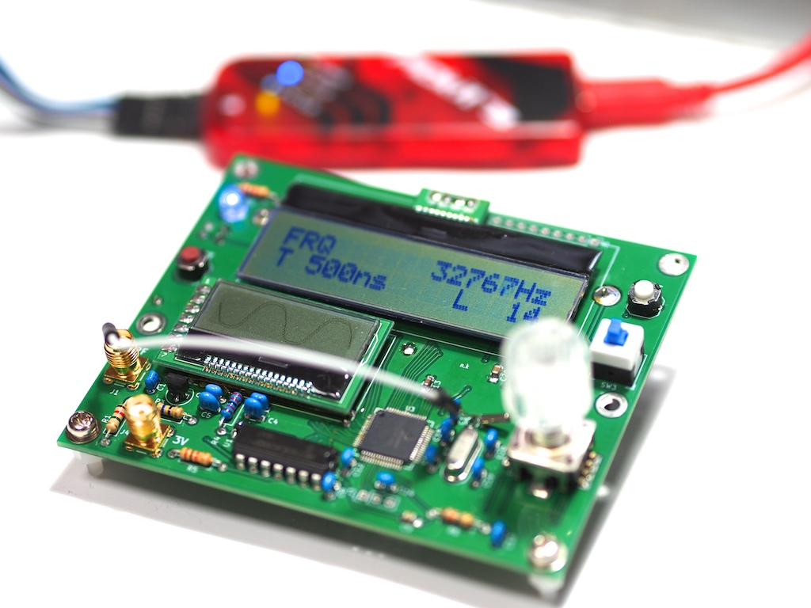

# Frequency Counter with Waveform Display
Frequency Counter: 48MHz and more  
Waveform Display: max 250ns/sample  

MPLAB X v5.25, XC15 v1.36b, PIC24 - 1.145.0

BOM
- PIC24FJ64GC006T-I/PT
- LCD I2C 16x2 character: AQM1602A
- LCD SPI 128x48 graphics: AQM1248
- Li-Ion Battery: 18650 x1
- DCDC Converter: LTC3245EMSE
- Rotary Encoder: EC12PLBOSDVF-D-25K-24-24C-31/0   
___  
It has no special plastic case yet..   
Thank You.
